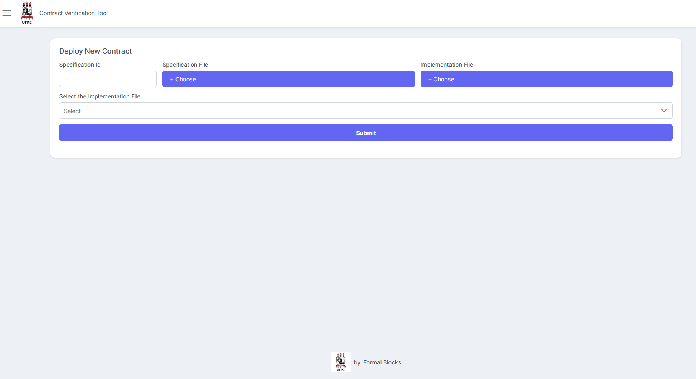
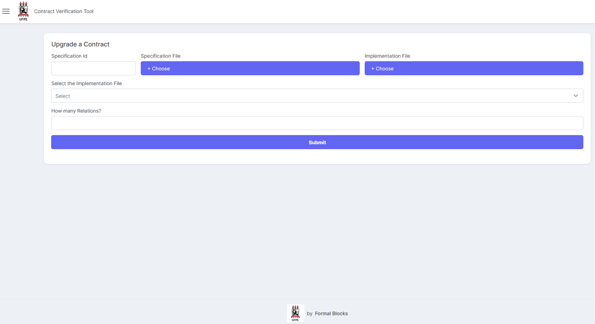

# A refinement-based approach to safe smart contract deployment and evolution!

 

## Introduction

Smart contracts is a term used to describe computer code that is capable of self-execute business agreements between parties. Although they can hold millions of dollars’ worth of digital assets, there is still a great deal of difficulty in determining during the development process whether the smart contract will actually perform its functions as expected. To help to tackle these problems we propose TrustedDeployer. A systematic framework,  based on the design-by-contract methodology, targeting the Ethereum platform, that requires smart contracts to be formally verified before deployment. Ensuring that smart contracts are created and upgraded when they met their expected specification. We evaluate our framework on a number of real-world contracts to illustrate the benefits that our framework could have in real life. Even though formal verification is a very computationally-intensive process, our evaluation demonstrates that the sort of application we propose seems very tractable. In order to auxiliate the process developed on this project we used [solc-verify](https://github.com/SRI-CSL/solidity/blob/boogie/SOLC-VERIFY-README.md) (**v0.5.17**) , a source-level verification tool built on top of the Solidity compiler, and invariants, pre- and post-conditions are provided as annotations.


## Repositories


Although it is a consensus among  academic researchers that the use of formal analysis tools can help to increase the quality and reliability of software, it is still a cumbersome task to integrate them in the daily software-development process. So, to help to fill the gap between industry and academia, after proposing our new approach for safe creation and evolution of smart contracts, we designed an experiment, in order to show how simple and adaptable for various scenarios our framework can be. Our examples were based on ERC20 and ERC1155  standards. Even though, these standards were developed by the ethereum community as a way of organizing and disseminate the knowledge among the stakeholders, there are still problems related to the use of natural language, because they are inherently ambiguous, in addition there is a great difficulty in maintaining traceability between requirements and code. These standards were developed by the Ethereum community as a way of organizing and disseminating knowledge among the stakeholders and establishing well-defined specifications to describe the behavior of each of its methods. The specifications for each ERC are expressed under the terms of the standard RFC 2119, which defines several keywords that help describe the requirements, guide the understanding of it and extract the formal specifications.


**ERC20**

Proposed in 2015 by Vitalik Buterin, ERC20 it is one of the first stan-dards defined for the ethereum platform, and is also one of the most used, withmore than 360000 thousand active tokens on the network. Since it was created,there have been several critical flaws related to its development that have led tolarge financial losses. Several  initiatives  have  emerged  with  proposals  to  deal  with  these  problems,one of which, OpenZeppelin, provides solutions to build, automate and operate decentralized application. We selected 9 ERC20 open repositories to run the experiment.

[Ambrosus](https://github.com/ambrosus/Ambrosus.git), [DsToken](https://github.com/dapphub/ds-token.git), [Uniswap](https://github.com/Uniswap/uniswap-v2-core.git), [SkinCoin](https://github.com/Steamtradenet/smart-contract.git), [0xMonorepo](https://github.com/0xProject/0x-monorepo.git), [Minime](https://github.com/Giveth/minime.git), [Klenergy](https://github.com/klenergy/ethereum-contracts.git), [Digixdao](https://github.com/DigixGlobal/digixdao-contracts.git), [Openzeppelin](https://github.com/OpenZeppelin/openzeppelin-contracts).


We also selected 5 ERC20 open repositories to to evaluate aspects related to changes in the data model and interface.


[Uniswap](https://github.com/Uniswap/uniswap-v2-core.git), [ConsenSys](https://github.com/ConsenSys/Tokens.git),
[SetProtocol](https://github.com/SetProtocol/set-protocol-contracts.git),[Digixdao](https://github.com/DigixGlobal/digixdao-contracts.git), [Bancor]()


**ERC1155**

The  ERC1155  standard  provides  an  interface  for  managing  anycombination of fungible and non-fungible tokens in a single contract efficiently. The standard was created in order to promote a better integration between the ERC20 and ERC721 standards, so with the ERC1155 token can perform the same functions as that the aforementioned tokens, improving the functionality of both and avoiding implementation errors. We selected 4 ERC20 open repositories to run the experiment.


[0xSequence](https://github.com/0xsequence/erc-1155), [Openzeppelin](https://github.com/OpenZeppelin/openzeppelin-contracts), [Enjin](https://github.com/enjin/erc-1155), [Decentralized Stock Market](https://github.com/esdras-santos/decentralized_stock_market_ERC1155).


**ERC3156**

The ERC3156 standard is composed by ERC3156FlashBorrower and ERC3156FlashLender interfaces and together they provide a standardization for single-asset flash loans. We selected 5 ERC3156 open repositories to run the experiment.


[ArgoBytes](https://github.com/SatoshiAndKin/argobytes-contracts.git), [Dss Flash](https://github.com/hexonaut/dss-flash.git), [Erc3156](https://github.com/fifikobayashi/ERC3156.git), [Wrappes](https://github.com/albertocuestacanada/ERC3156-Wrappers.git), [Weth10](https://github.com/WETH10/WETH10.git).


**ERC721**

The ERC-721 standard defines a minimum interface a smart contract must implement to allow unique tokens to be managed, owned, and traded. The more common term used to refer to these assets is non-fungible tokens. We selected 1 ERC721 open repository to run the experiment. We also selected 1 ERC721 open repositories to to evaluate aspects related to changes in the data model and interface.

[Openzeppelin](https://github.com/OpenZeppelin/openzeppelin-contracts)

## Verify contracts

In order to build the docker container and verify the smart contracts in this repository. Please follow the instructions presented in [solc-verify](https://github.com/SRI-CSL/solidity/blob/boogie/docker/README.md) github page.

## Running The Trusted Deployer Tool

First you should execute the following commands:


```
cd inv-evo
docker build -t alloy .  
```

The Docker file on the rooot folder allows us to quickly run the Verification Tool.
To build the tool in a docker container you should clone the project and  run the the following commands:

```
docker-compose build
docker-compose up 
```


## Running The Verification Tool


This Docker allows us to quickly run the Verification Tool.
To build the tool in a docker container you should clone the project and in the tool directory run the the following command:

```
docker-compose up --build tool
```

The tool can be accessed through the link: http://localhost:3000/#/

To access the features of the tool it is necessary to have a metamask wallet. All instructions for creating, importing, and getting backgrounds are on the tool's documentation page.


 ## Smart Contract Creation Process


To increase the security of the tool, we do not store or manage the user's private key, instead we use a 
custodial crypto wallet so the user is not in control of the funds and contracts deployed. 

    
To understand the implementation challenges for registering contracts on the blockchain, it is necessary to evaluate the processes related to the Trusted Deployer tool's deployer module. Figure below shows a screenshot of the creation smart contract process, according to the workflow, 
that will ensure for all participants that interact with the 
smart contract that a given instance was created by the Trusted Deployer by calling its get-spec function; therefore it is formally verified and safe. The user must also upload the specification and implementation files. Solidity supports multiple inheritance, so multiple contracts can be inherited by a contract that is known as a derived contract. In this case the user must inform the derived contract to be verified and constructor parameters when they exist. 





 ## Smart Contract Upgrading Process


Considering the good practices to handle the wallet described in the previous section, 
                    we defined a procedure to upgrade smart contracts. From the moment a connection is 
                    established between the wallet and the, the user has access to the historical data 
                    generated from the smart contract deployment. After input of and implementation 
                    smart contract, the tool must check if there is a record of a corresponding specification; 
                    if there is, the update process will occur automatically. In this case only the implementation 
                    smart contract is sent to the blockchain and its address is registered in the proxy.





## Upgrading Smart Contracts Using Remix


To create smart contracts on the Ethereum blockchain, developers might require an environment that simplifies the development process, provides useful tools and features, and streamlines the testing and debugging of smart contracts. [Remix IDE](https://remix.ethereum.org/) fulfills these requirements and is widely used by developers for Solidity Smart Contract Development.

In this Tutorial, we will cover how to use Remix IDE for Solidity Smart Contract deployment and upgrading using our proposed methodology.


**Step 1: Set up the Remix Environment**

In order to deploy or update a smart contract using Remix, it must be connected to a MetaMask wallet and run in the Injected Web3 environment. In Remix go to Deploy & Run Transactions and select an Injected provider - Metamask from the dropdown.


**Step 2: Create a ToyWallet Smart Contract in Remix**

We can create a **ToyWallet.sol** contract by clicking on the “+” button in the file explorer section. Alternatively, we can import an existing contract by clicking on the folder icon and selecting the contract file from the local system.


```solidity
contract ToyWallet {
	mapping (address => uint) accs;
	
	function deposit () payable public {
		accs[msg.sender] = accs[msg.sender] + msg.value;
	}
	
	function withdraw (uint value) public {
		require(accs[msg.sender] >= value);
		bool ok = msg.sender.send(value);
		require(ok);
		accs[msg.sender] = accs[msg.sender] - value;
	}
}	
```

**Step 4: Compile the Smart Contract**

In the Remix IDE interface, go to the “Solidity Compiler” tab on the left sidebar. Choose the desired compiler version from the drop-down menu. Click on the button to compile the loaded smart contract.


**Step 5: Connect Remix to MetaMask**

In the Remix IDE interface, click on the “Deploy & run transactions” tab on the left sidebar. Under the “Environment” section, select “WalletConnect” (it’s called Injected Web3 in previous versions of Remix IDE) from the drop-down menu. This will connect Remix IDE to your wallet, in this tutorial’s case Metamask wallet.


**Step 6: Deploy a Smart Contract on a Network**

In order to deploy the smart contract, we should first select it from the dropdown and then click on the deploy button. 


**Step 7: Create a Proxy Smart Contract in Remix**

We can create or import a **Proxy.sol** contract in the file explorer section. We should provide to its constructor the facet address (ToyWallet), the trusted deployer address and the init function contract address.

```solidity
contract Proxy {

address facet;
address trusted_deployer;

constructor(address _facet, address _trusted_deployer, address _constructor) public {
    facet = _facet;
    trusted_deployer = _trusted_deployer;
    _constructor.delegatecall(abi.encodeWithSignature("cons()"));
}
event Fallback();

function update(address _facet, address _init) public {
    require(msg.sender == trusted_deployer);
    facet = _facet;
    if (_init != address(0)){
        _init.delegatecall(abi.encodeWithSignature("init()"));
    }
}

function() external payable {

  address _facet = facet;

    emit Fallback();

  assembly {
    calldatacopy(0, 0, calldatasize())
    let result := delegatecall(gas(), _facet, 0, calldatasize(), 0, 0)
    returndatacopy(0, 0, returndatasize())
    switch result
      case 0 {revert(0, returndatasize())}
      default {return (0, returndatasize())}
  }
}

}
```

**Step 8: Create a ToyWalletNew Smart Contract in Remix**

We can create or import a **ToyWalletNew.sol** contract in the file explorer section.


```solidity
contract ToyWalletNew {

  struct Account {
		uint bal;
		bool is_open;
	}

	mapping (address => Account) accs;
	
	function deposit () payable public {
		accs[msg.sender].bal = accs[msg.sender].bal + msg.value;
	}
	
	function withdraw (uint value) public {
		require(accs[msg.sender].bal >= value);
		bool ok = msg.sender.send(value);
		require(ok);
		accs[msg.sender].bal = accs[msg.sender].bal - value;
	}

  function open () public view returns (bool) {
		return accs[msg.sender].is_open;
	}
}	
```

**Step 9: Update Proxy Smart Contract**

To upgrade a smart contract, we should invoke the proxy update function by providing the facet address (ToyWalletNew) and init function contract address.


##  Citing

This research is a part of effort to extend the work that we present in the 20th International Conference on
Software Engineering and Formal Methods [[1]](#1); and the  Software and Systems Modeling journal that focuses on theoretical and practical issues in the development and application of software and system modeling languages, techniques, and methods, such as the Unified Modeling Language [[2]](#2). If you want to refer to our previous work, please use the following BibTeX entry for citations.


##  References

<a id="1">[1] Antonino, P., Ferreira, J., Sampaio, A., Roscoe, A.W. (2022). Specification is Law: Safe Creation and Upgrade of Ethereum Smart Contracts. In: Schlingloff, BH., Chai, M. (eds) Software Engineering and Formal Methods. SEFM 2022. Lecture Notes in Computer Science, vol 13550. Springer, Cham. https://doi.org/10.1007/978-3-031-17108-6_14

<a id="2">[2] Antonino, P., Ferreira, J., Sampaio, A. et al. A refinement-based approach to safe smart contract deployment and evolution. Softw Syst Model 23, 657–693 (2024). https://doi.org/10.1007/s10270-023-01143-z
